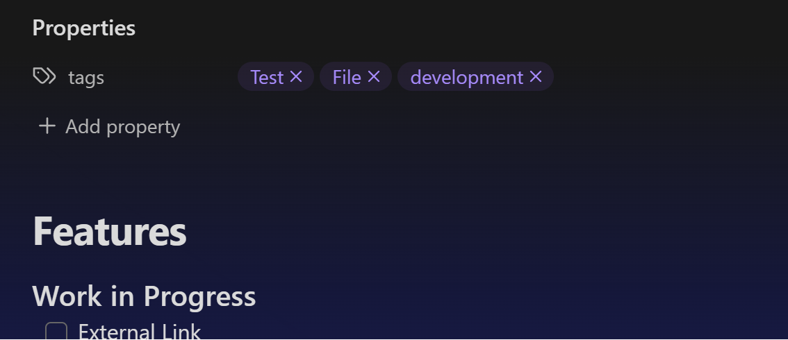
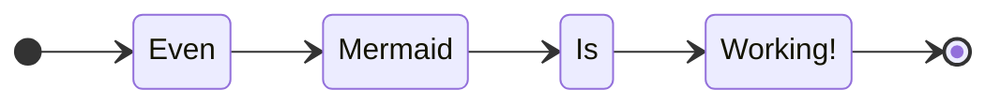

# Features
#### Work in Progress
- [ ] External Link
[https://obsidian.md/](https://obsidian.md/)

- [ ] Link to local File
[test file 1 link](/file1)

- [ ] File link Embed
[[file1]]

- [ ] Inline Local Image



- [ ] Inline Local Image Embed

![[img.png]]

- [ ] Inline Remote Image


- [ ] Codeblock with Language Sintax

```typescript
type StringFn: () => string
const test: StringFn = () => 'Testing Sintax, this is working...';
```

- [ ] Code without sintax
```
asdasd
asd
s
s

s


ssa
a
a
s

```

- [ ] Tables

|A|B|
|-|-|
|1|2|

- [ ] Mermaid Diagram



- [ ] Custom Css Snippets
# Css Snippet

- [ ] Theme

- [ ] Callout

> [!tip] Callout
> Callout Contents

- [ ] Callout Icon

>[!example] Test
>this is another callout

- [ ] Callout in Embedded File

![[Callouts]]

- [ ] Embedded File

![[file1]]

- [ ]  Canvas
![[test.canvas]]

- [ ] File resolver
[[x/y/z_1/Test]]
[[file resolver test]]

